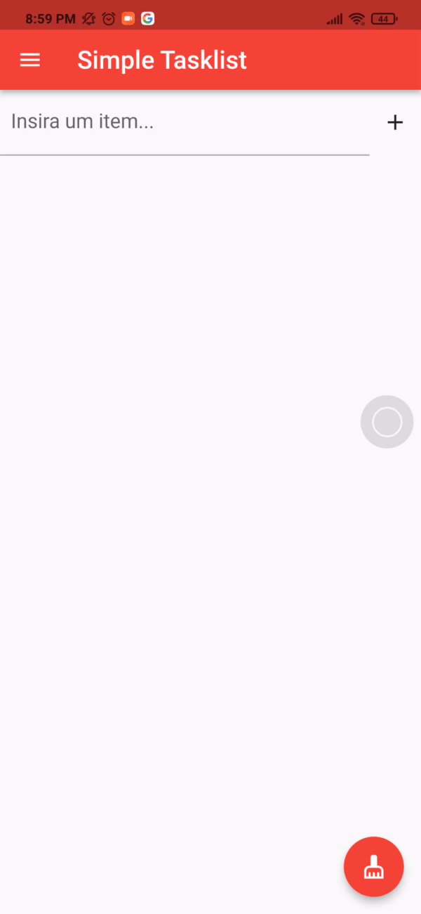

# Simple Tasklist

> :construction: Projeto em construção :construction:

## :newspaper: Descrição :newspaper:

App criado para treinar o desenvolvimento com a framework Flutter e a linguagem Dart.

## :hammer: Funcionalidades: :hammer:
- [x] Adicionar itens (CheckBoxListTile)
- [x] Remover item (IconButton)
- [x] Remover todos os itens (FloatingActionButton)
- [x] Menu Drawer
- [x] Switch com Darkmode
- [x] Navegar entre páginas
- [ ] Consumir uma API
- [ ] Armazenas itens do checklist no localstorage
- [ ] Área de login 
- [ ] Tour pelo app (help)   
 
## :tv: Demonstração :tv:

